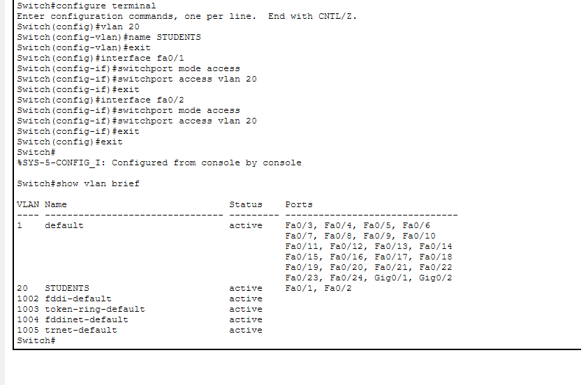
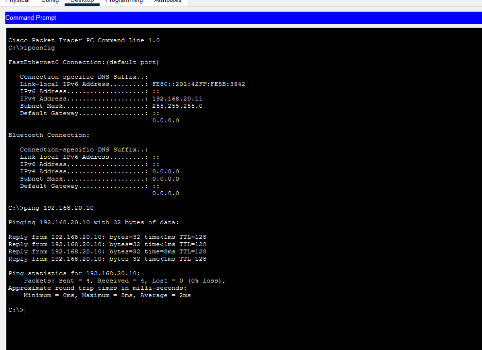

````markdown
# NET-002 – VLAN Not Created

## Problem
VLAN 20 was not initially present on the Cisco switch.

## Topology
- 1 Cisco 2960 Switch
- 2 PCs
- PC0 → Fa0/1
- PC1 → Fa0/2

## IP Configuration

**PC0:** `192.168.20.10 / 255.255.255.0`  
**PC1:** `192.168.20.11 / 255.255.255.0`

## Solution

VLAN 20 was created and named `STUDENTS`.

```bash
vlan 20
name STUDENTS
````

The ports connected to both PCs were configured as access ports and assigned to VLAN 20:

```bash
interface fa0/1
switchport mode access
switchport access vlan 20

interface fa0/2
switchport mode access
switchport access vlan 20
```

## Verification

The VLAN configuration was checked using:

```bash
show vlan brief
```

The result confirmed:

```text
20   STUDENTS   active   Fa0/1, Fa0/2
```

Connectivity was tested using:

```bash
ping 192.168.20.10
```

**Result:** 4 packets received, 0% packet loss. ✅

## Screenshots

### VLAN Configuration



### Ping Verification



## Result

VLAN 20 was successfully created, the required ports were assigned to it, and connectivity between the two PCs was successfully verified.

## What I Learned

* How to create a VLAN
* How to assign switch ports to a VLAN
* How to verify VLANs using `show vlan brief`
* How to test connectivity using `ping`

```
```
