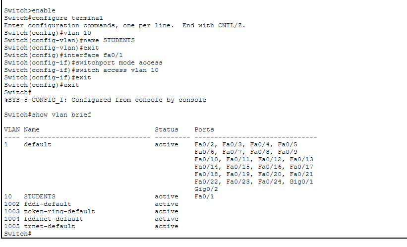
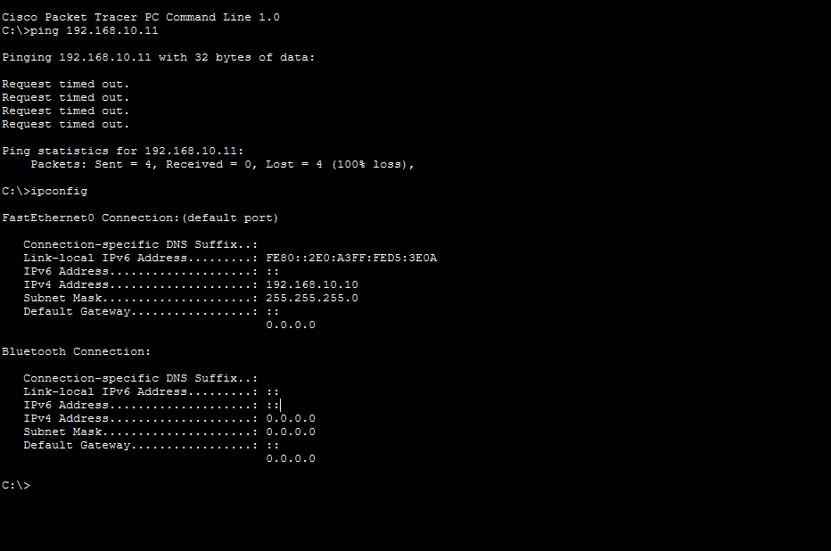
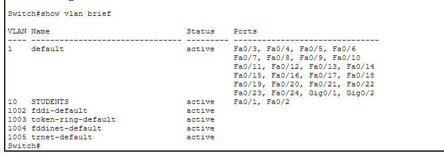
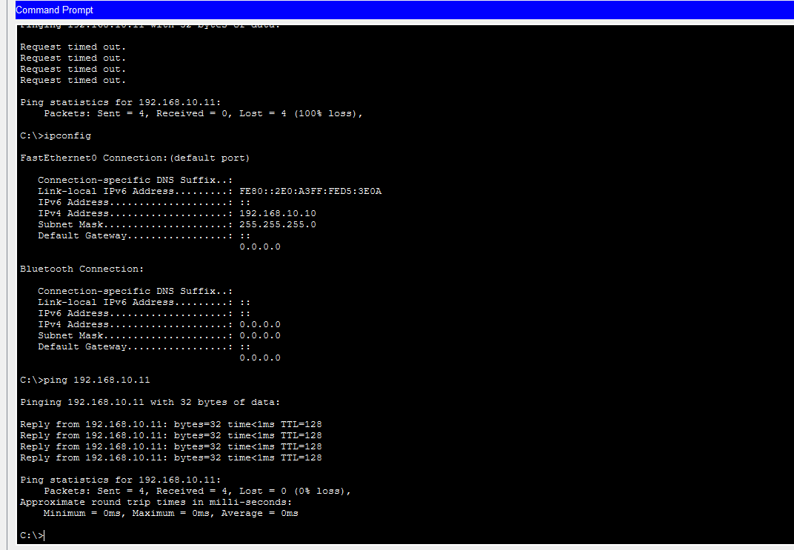

# NET-004 – Port Left in Default VLAN

## Problem

A new PC was connected to the switch, but its switch port was still in the default VLAN 1 instead of the required student VLAN 10.

## Topology

- 1 Cisco 2960 Switch
- 2 PCs
- PC0 → Fa0/1
- PC1 → Fa0/2

## IP Configuration

**PC0:** `192.168.10.10 / 255.255.255.0`

**PC1:** `192.168.10.11 / 255.255.255.0`

## VLAN Configuration

VLAN 10 was created and named `STUDENTS`.

PC0's port was assigned to VLAN 10:

```bash
interface fa0/1
switchport mode access
switchport access vlan 10

PC1's port was initially left in the default VLAN 1.

Problem Verification

The VLAN configuration was checked using:

show vlan brief

The result showed:

Fa0/1 → VLAN 10
Fa0/2 → VLAN 1

Therefore, the two PCs were placed in different VLANs.

Wrong VLAN Configuration

Connectivity Test

The following command was used:

ping 192.168.10.11

The ping initially failed because PC0 and PC1 were connected to different VLANs.


Failed Ping

Solution

PC1's switch port Fa0/2 was configured as an access port and assigned to VLAN 10:

interface fa0/2
switchport mode access
switchport access vlan 10
Verification

The VLAN configuration was checked again:

show vlan brief

The result showed:

10   STUDENTS   active   Fa0/1, Fa0/2

Both PC ports were now in VLAN 10.

Correct VLAN Configuration

Final Connectivity Test

The ping was performed again:

ping 192.168.10.11

The result was successful with:

Packets Sent = 4
Received = 4
Lost = 0
Successful Ping

Result

The problem was successfully resolved by moving PC1's switch port from the default VLAN 1 to VLAN 10.

Both PCs were then in the same VLAN and could communicate successfully.

What I Learned
The default VLAN on a switch is VLAN 1.
A switch port can be assigned to a specific VLAN.
Two PCs in different VLANs cannot communicate directly at Layer 2.
show vlan brief can be used to check VLAN and port assignments.
ping can be used to verify connectivity.





