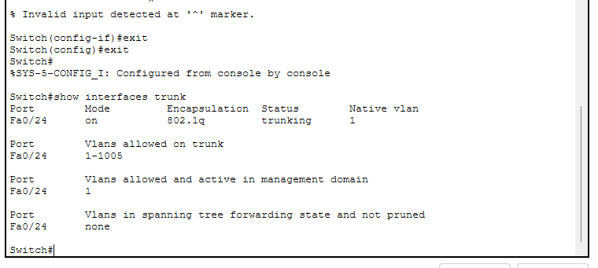
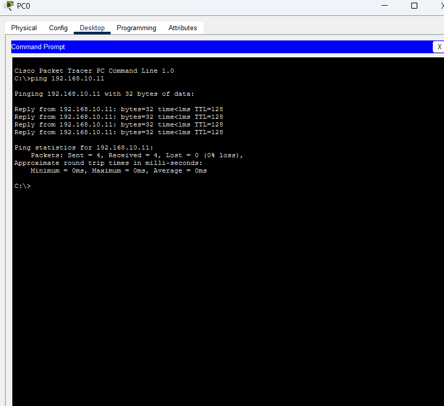

# NET-005 – Simple Trunk Problem

## Problem

Two PCs were connected to two different switches. Both PCs were configured in VLAN 10, but the inter-switch link was not configured as a trunk.

Because of this, the same VLAN could not communicate properly across the two switches.

## Topology

- 2 Cisco 2960 Switches
- 2 PCs
- SW1 Fa0/1 → PC0
- SW2 Fa0/1 → PC1
- SW1 Fa0/24 → SW2 Fa0/24

## IP Configuration

**PC0:** `192.168.10.10 / 255.255.255.0`

**PC1:** `192.168.10.11 / 255.255.255.0`

## VLAN Configuration

VLAN 10 was created on both switches and named `STUDENTS`.

PC0 was assigned to VLAN 10:

```bash
interface fa0/1
switchport mode access
switchport access vlan 10

PC1 was also assigned to VLAN 10:

interface fa0/1
switchport mode access
switchport access vlan 10
Problem Verification

The inter-switch connection was checked using:

show interfaces trunk

The inter-switch port was not shown as a trunk.

Trunk Not Configured

Connectivity Test

The following command was used from PC0:

ping 192.168.10.11

The ping initially failed because the inter-switch link was not configured as a trunk.

Ping Failed

Solution

The inter-switch port Fa0/24 was configured as a trunk on both switches.

SW1
interface fa0/24
switchport mode trunk
SW2
interface fa0/24
switchport mode trunk
Verification

The trunk configuration was checked using:

show interfaces trunk

The inter-switch port was now operating as a trunk.

Trunk Configured

Final Connectivity Test

The ping was performed again:

ping 192.168.10.11

The result was successful with:

Packets Sent = 4
Received = 4
Lost = 0
Successful Ping

Result

The inter-switch link was successfully configured as a trunk.

Both switches were able to carry VLAN 10 traffic across the link, and PC0 successfully communicated with PC1.

What I Learned
What a trunk port is.
Why a trunk is needed between switches when carrying VLAN traffic.
How to configure a switch port as a trunk.
How to verify trunk configuration using show interfaces trunk.
How to test connectivity using ping.


