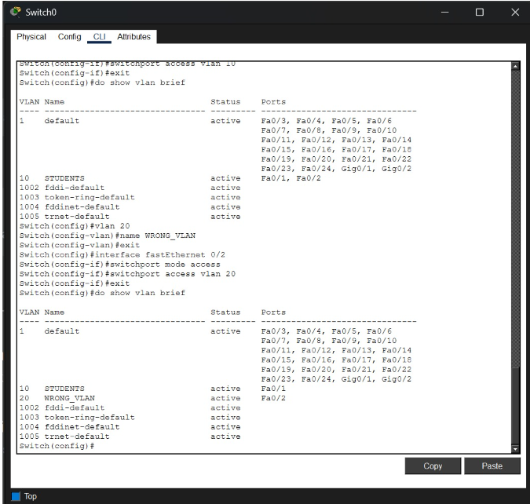
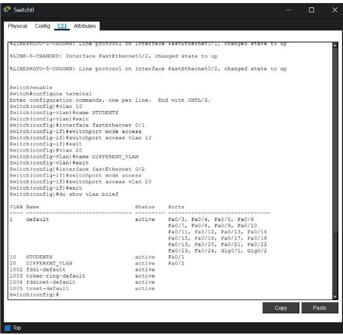
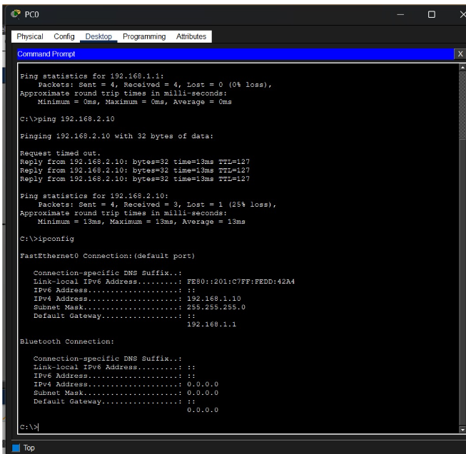

# NET-006 – Missing Default Gateway

## Problem

A PC can communicate with its local network but cannot reach a remote network because its default gateway is missing.

## Topology

- 1 Cisco 1941 Router
- 2 Cisco 2960 Switches
- 2 PCs
- PC0 → Switch0 → Router0
- Router0 → Switch1 → PC1

The router connects two different LANs.

```text
PC0 ── Switch0 ── Router0 ── Switch1 ── PC1
       LAN 1                    LAN 2
```

## IP Configuration

### PC0

```text
IP Address:       192.168.1.10
Subnet Mask:      255.255.255.0
Default Gateway:  0.0.0.0
```

### Router0 – G0/0

```text
IP Address:       192.168.1.1
Subnet Mask:      255.255.255.0
```

### Router0 – G0/1

```text
IP Address:       192.168.2.1
Subnet Mask:      255.255.255.0
```

### PC1

```text
IP Address:       192.168.2.10
Subnet Mask:      255.255.255.0
Default Gateway:  192.168.2.1
```

## Normal Network Configuration

The router interfaces were configured as follows:

```bash
enable
configure terminal

interface gigabitEthernet 0/0
ip address 192.168.1.1 255.255.255.0
no shutdown
exit

interface gigabitEthernet 0/1
ip address 192.168.2.1 255.255.255.0
no shutdown
exit
```

The router interfaces were verified using:

```bash
show ip interface brief
```

The result confirmed:

```text
GigabitEthernet0/0    192.168.1.1    up    up
GigabitEthernet0/1    192.168.2.1    up    up
```

## Fault Introduced

The default gateway of PC0 was intentionally removed.

The original gateway:

```text
192.168.1.1
```

was changed to:

```text
0.0.0.0
```

Therefore, PC0 had no default gateway configured.

## Symptom

PC0 could communicate with its local router but could not reach the remote network.

Local gateway test:

```bash
ping 192.168.1.1
```

**Result:** Successful. ✅

Remote network test:

```bash
ping 192.168.2.10
```

**Result:** Failed with 100% packet loss. ❌

## Evidence Collection

The PC configuration was checked using:

```bash
ipconfig
```

The actual evidence showed:

```text
IPv4 Address:       192.168.1.10
Subnet Mask:        255.255.255.0
Default Gateway:    0.0.0.0
```

The `Default Gateway: 0.0.0.0` value proves that the default gateway was missing.

## Expected Evidence

```text
Default Gateway: 0.0.0.0
```

The PC should have had:

```text
Default Gateway: 192.168.1.1
```

## Root Cause

**Missing default gateway.**

PC0 had no default gateway configured, so it could communicate with devices on its local network but could not forward traffic to the remote network `192.168.2.0/24`.

## OSI Layer

**Layer 3 – Network Layer**

## Concept

**Default Gateway / Routing**

## Severity

**Low**

## Solution

The correct default gateway was configured on PC0:

```text
Default Gateway: 192.168.1.1
```

The gateway address matches the router's LAN interface:

```text
Router G0/0 → 192.168.1.1
```

## Verification

After restoring the default gateway, the remote PC was tested again:

```bash
ping 192.168.2.10
```

The ping was successful. ✅

This confirmed that the missing default gateway was the cause of the problem.

## Screenshots

### Router Interface Verification

_Add screenshot of `show ip interface brief` showing both router interfaces as up/up._

### Local Ping

_Add screenshot showing successful ping to `192.168.1.1`._

### Remote Ping Failure

_Add screenshot showing failed ping to `192.168.2.10` before fixing the gateway._

### IP Configuration Evidence

_Add screenshot of `ipconfig` showing `Default Gateway: 0.0.0.0`._

### Remote Ping Verification

_Add screenshot showing successful ping to `192.168.2.10` after restoring the gateway._

## Evidence Used

The troubleshooting decision was based on the actual Packet Tracer command:

```bash
ipconfig
```

The command showed:

```text
IPv4 Address:       192.168.1.10
Subnet Mask:        255.255.255.0
Default Gateway:    0.0.0.0
```

The evidence directly identified the missing default gateway.

Additional connectivity evidence showed:

```text
ping 192.168.1.1 → Successful
ping 192.168.2.10 → Failed
```

This demonstrated that local communication worked while communication with the remote network failed.

## Result

The missing default gateway was successfully identified using `ipconfig`. PC0 had a gateway value of `0.0.0.0`, which prevented it from reaching the remote network. After setting the gateway to `192.168.1.1`, communication with PC1 on the remote network was successfully restored.

## What I Learned

- How to connect two LANs using a router
- How to configure router interfaces
- How to configure IP addresses on PCs
- What a default gateway does
- How a missing gateway affects remote network communication
- How to use `ipconfig` as troubleshooting evidence
- How to identify a Layer 3 networking problem
- How to verify connectivity using `ping`
- How to restore connectivity by configuring the correct default gateway



