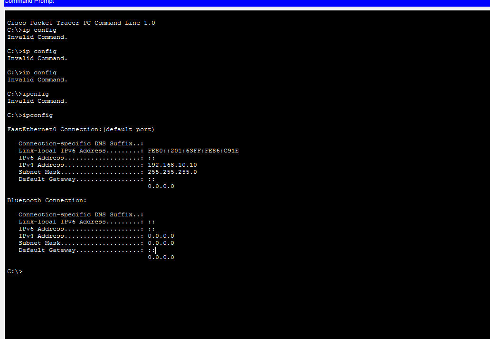

# NET-007 – Wrong Default Gateway

## Problem

PC0 cannot reach another network because its default gateway is incorrectly configured.

## Topology

- 1 Router
- 2 Cisco 2960 Switches
- 2 PCs

```text
PC0 ── SW1 ── Router ── SW2 ── PC1
IP Configuration

PC0

IP Address: 192.168.10.10
Subnet Mask: 255.255.255.0
Default Gateway: 192.168.10.254 ❌

PC1

IP Address: 192.168.20.10
Subnet Mask: 255.255.255.0
Default Gateway: 192.168.20.1

Router

G0/0: 192.168.10.1
G0/1: 192.168.20.1
Problem Verification

The PC configuration was checked using:

ipconfig

PC0 was using:

Default Gateway: 192.168.10.254

However, the correct router interface was:

192.168.10.1
Wrong Gateway

Connectivity Test

The remote network was tested using:

ping 192.168.20.10

The ping failed because the default gateway was incorrect.

Ping Failed

Solution

The default gateway of PC0 was changed from:

192.168.10.254

to:

192.168.10.1
Verification

The configuration was checked again using:

ipconfig

The correct gateway was displayed.

Correct Gateway

Final Connectivity Test

The remote network was tested again:

ping 192.168.20.10

The ping was successful with:

Packets Sent = 4
Received = 4
Lost = 0
Successful Ping

Result

The wrong default gateway was identified and corrected.

After configuring the correct gateway, PC0 was able to communicate with the remote network successfully.

What I Learned
What a default gateway is.
Why a gateway is required to reach another network.
How to check gateway information using ipconfig.
How an incorrect gateway can cause remote connectivity problems.
How to verify connectivity using ping.

