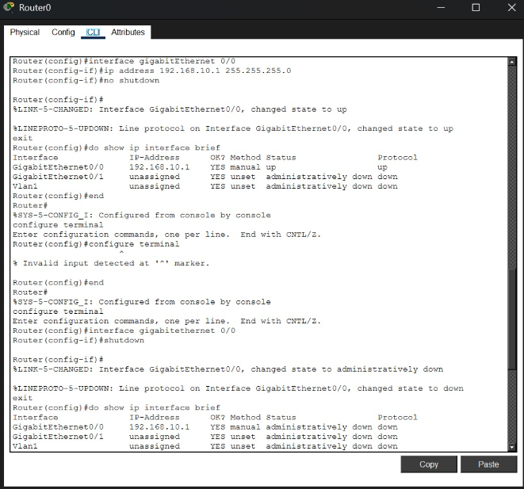
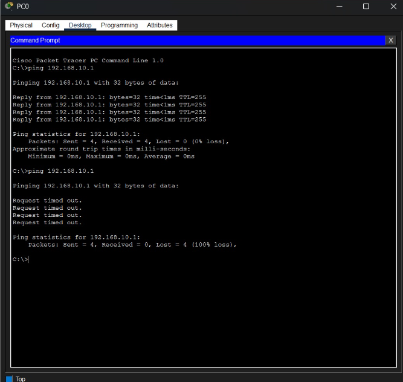

# NET-008 – Gateway Interface Down

## Problem

The PC cannot ping its default gateway because the router's LAN interface is administratively shut down.

## Topology

- 1 Cisco 1941 Router
- 1 Cisco 2960 Switch
- 1 PC
- PC0 → Switch0 → Router0

```text
PC0 ─── Switch0 ─── Router0
```

## IP Configuration

### PC0

```text
IP Address:       192.168.10.10
Subnet Mask:      255.255.255.0
Default Gateway:  192.168.10.1
```

### Router0 – GigabitEthernet0/0

```text
IP Address:       192.168.10.1
Subnet Mask:      255.255.255.0
```

## Normal Configuration

The router interface was configured using:

```bash
enable
configure terminal

interface gigabitEthernet 0/0
ip address 192.168.10.1 255.255.255.0
no shutdown
exit
```

The interface was initially working correctly.

The PC was able to ping the router:

```bash
ping 192.168.10.1
```

**Result:** Successful. ✅

## Fault Introduced

To create the troubleshooting problem, the router's GigabitEthernet0/0 interface was intentionally shut down.

```bash
configure terminal
interface gigabitEthernet 0/0
shutdown
```

The router reported that the interface changed to:

```text
administratively down
```

## Symptom

The PC cannot ping its router/default gateway.

The following command was used on PC0:

```bash
ping 192.168.10.1
```

**Result:** Request timed out. ❌

## Evidence Collection

The router interface status was checked using:

```bash
show ip interface brief
```

The output showed:

```text
GigabitEthernet0/0    192.168.10.1    administratively down
```

This is the main evidence for the case.

## Expected Evidence

The expected evidence is:

```text
GigabitEthernet0/0    192.168.10.1    administratively down
```

This indicates that the router's LAN interface has been manually disabled.

## Expected Fault / Root Cause

**Gateway interface shutdown.**

The router's GigabitEthernet0/0 interface was administratively shut down using the `shutdown` command.

## OSI Layer

**Layer 3 – Network Layer**

## Concept

**Gateway / Router Interface**

## Severity

**Low**

## Diagnosis

The PC cannot reach its default gateway because the router's LAN interface is administratively down.

The `show ip interface brief` command provides direct evidence:

```text
GigabitEthernet0/0    192.168.10.1    administratively down
```

Therefore, the likely root cause is a manually disabled gateway interface.

## Solution

The router interface was enabled using:

```bash
configure terminal
interface gigabitEthernet 0/0
no shutdown
```

The expected result is:

```text
GigabitEthernet0/0    192.168.10.1    up    up
```

## Verification

After applying `no shutdown`, the router interface was checked again:

```bash
show ip interface brief
```

The interface changed from:

```text
administratively down
```

to:

```text
up
up
```

The PC was then tested again:

```bash
ping 192.168.10.1
```

**Result:** Successful. ✅

This confirmed that the gateway interface was restored and connectivity was working again.

## Evidence Used

The main troubleshooting evidence was collected using:

```bash
show ip interface brief
```

Actual evidence:

```text
GigabitEthernet0/0    192.168.10.1    administratively down
```

The connectivity evidence was:

```text
Before Fix:
ping 192.168.10.1 → Failed ❌

After Fix:
ping 192.168.10.1 → Successful ✅
```

## Screenshots

### 1. Network Topology

_Add screenshot showing:_

```text
PC0 ─── Switch0 ─── Router0
```

### 2. Interface Down Evidence

_Add screenshot of:_

```bash
show ip interface brief
```

showing:

```text
GigabitEthernet0/0    192.168.10.1    administratively down
```

### 3. Ping Failure

_Add screenshot showing:_

```bash
ping 192.168.10.1
```

with failed/time-out packets.

### 4. Interface After Fix

_Add screenshot of:_

```bash
show ip interface brief
```

showing:

```text
GigabitEthernet0/0    192.168.10.1    up    up
```

### 5. Successful Ping

_Add screenshot showing successful:_

```bash
ping 192.168.10.1
```

## Result

The gateway interface failure was successfully reproduced and diagnosed.

The `show ip interface brief` command showed that GigabitEthernet0/0 was **administratively down**. The interface was restored using:

```bash
no shutdown
```

After the fix, the interface became **up/up** and the PC successfully pinged the router.

## What I Learned

- How to configure a router LAN interface
- How to configure a PC's default gateway
- How to intentionally shut down a router interface
- How to identify an administratively down interface
- How to use `show ip interface brief` as troubleshooting evidence
- How to diagnose a Layer 3 gateway problem
- How to restore an interface using `no shutdown`
- How to verify the fix using `ping`


