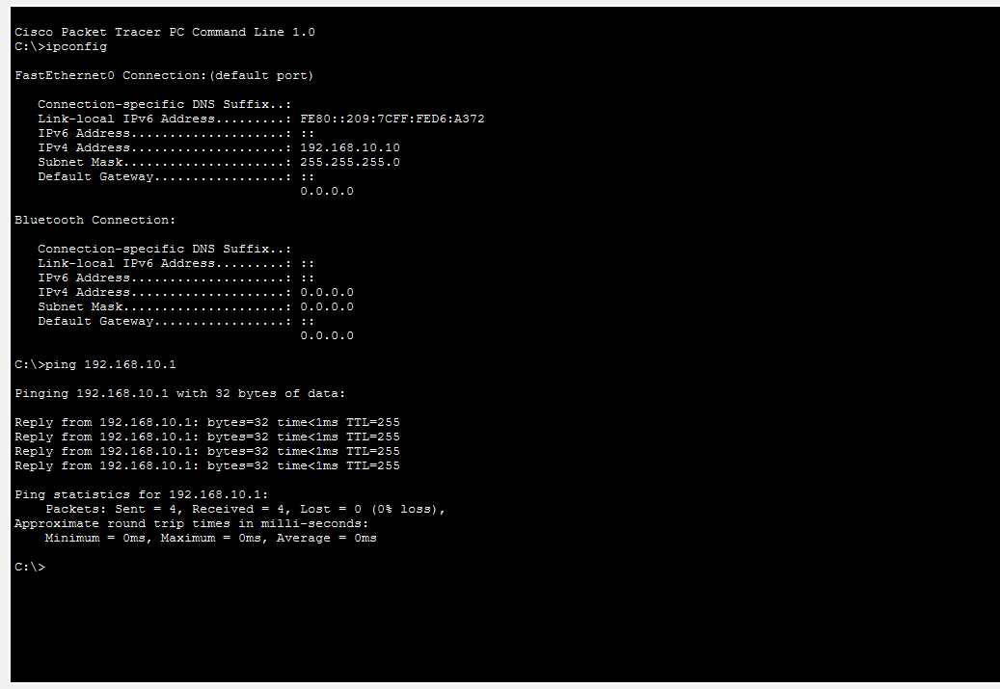
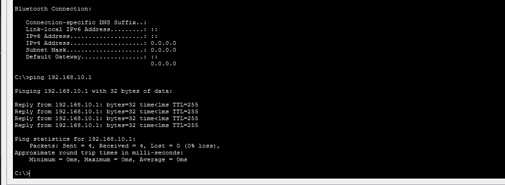

# NET-009 – Gateway IP Mismatch

## Problem

The PC has a default gateway configured, but it cannot reach the router because the gateway address does not match the router's LAN IP.

## Topology

```text
PC0 ─── Switch0 ─── Router0

Devices used:

1 PC
1 Cisco 2960 Switch
1 Cisco 1941 Router
IP Configuration
Router0

Interface:

GigabitEthernet0/0
IP Address: 192.168.10.1
Subnet Mask: 255.255.255.0
PC0

Initial configuration:

IP Address: 192.168.10.10
Subnet Mask: 255.255.255.0
Default Gateway: 192.168.10.254

The gateway 192.168.10.254 is intentionally incorrect.

Evidence Collection

The router interface was checked using:

show ip interface brief

The router LAN interface was found as:

GigabitEthernet0/0
192.168.10.1
Router Interface

The PC configuration was checked using:

ipconfig

The PC had:

Default Gateway: 192.168.10.254
Wrong Gateway

Root Cause

The PC's gateway and the router's LAN IP were different.

PC Gateway:      192.168.10.254 ❌
Router LAN IP:   192.168.10.1   ✅

Therefore, the problem was a Gateway IP Mismatch.

Solution

The PC's default gateway was changed from:

192.168.10.254

to:

192.168.10.1
Verification

The PC configuration was checked again using:

ipconfig

The correct gateway was displayed:

Default Gateway: 192.168.10.1
Correct Gateway

The connection was tested using:

ping 192.168.10.1

The ping was successful.

Successful Ping

Result

The gateway IP mismatch was successfully identified and fixed.

After configuring the PC with the correct gateway address, the PC was able to communicate with the router.

What I Learned
How to configure a router LAN interface.
How to check router interface information using show ip interface brief.
How to check PC network configuration using ipconfig.
What a default gateway is.
How to identify a gateway IP mismatch.
How to verify connectivity using ping.


